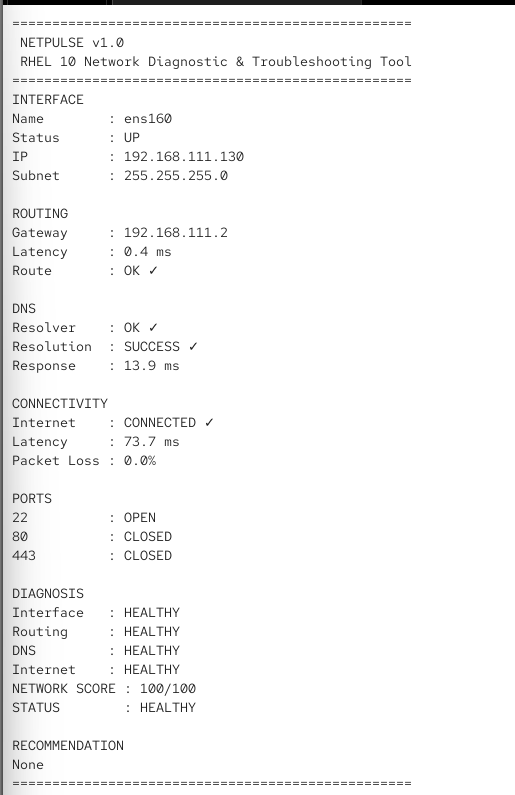

# NetPulse v1.0

## RHEL 10 Network Diagnostic & Troubleshooting Tool

NetPulse is a modular Python-based network diagnostic and troubleshooting tool designed for RHEL 10 and Linux systems.

It performs multiple network health checks including interface detection, routing, DNS, internet connectivity, latency, packet loss, and TCP port availability. The tool combines these results into an overall network health score with diagnostic status and recommendations.

---

##  Overview

NetPulse is designed to provide a lightweight command-line solution for basic Linux network troubleshooting.

Instead of manually executing multiple networking commands, NetPulse combines common diagnostic checks into a single automated tool and presents the results in a structured report.

### Main Diagnostic Areas

- Network Interface
- IP Address and Subnet
- Default Gateway
- Routing
- DNS
- Internet Connectivity
- Latency
- Packet Loss
- TCP Ports
- Network Health Score
- Diagnostic Recommendations

---

##  Features

- Active network interface detection
- Interface status detection
- IPv4 address detection
- Subnet detection
- Default gateway detection
- Route reachability testing
- Gateway latency measurement
- DNS resolver validation
- DNS resolution testing
- DNS response-time measurement
- Internet connectivity testing
- Network latency measurement
- Packet-loss detection
- TCP port availability checking
- Automated network health scoring
- HEALTHY, WARNING and CRITICAL status
- Diagnostic recommendations
- Graceful handling of command failures
- Timeout handling
- RHEL 10 compatibility
- Python standard library based implementation
- No external pip packages required

---

##  Architecture

```text
                         NetPulse
                            |
                     netpulse.py
                    Main Controller
                            |
        +-------------------+-------------------+
        |                   |                   |
   interface.py         routing.py          dns.py
   Interface/IP         Gateway/Route        DNS Checks
        |                   |                   |
        +-------------------+-------------------+
                            |
                 connectivity.py
               Internet/Latency/Loss
                            |
                       ports.py
                    TCP Port Checks
                            |
                      diagnosis.py
                Health Score & Analysis
                            |
                    Diagnostic Report
```

---

##  Module Responsibilities

| Module | Responsibility |
|---|---|
| `netpulse.py` | Main controller and report generation |
| `interface.py` | Interface status, IP address and subnet detection |
| `routing.py` | Gateway, route reachability and latency checks |
| `dns.py` | DNS resolver and DNS resolution checks |
| `connectivity.py` | Internet connectivity, latency and packet loss |
| `ports.py` | TCP port availability checks |
| `diagnosis.py` | Network health scoring and recommendations |

---

##  How It Works

NetPulse performs the diagnostic workflow in the following sequence:

1. Detects the active network interface.
2. Collects the IP address and subnet information.
3. Detects the default gateway.
4. Checks route reachability.
5. Measures gateway latency.
6. Validates DNS resolver configuration.
7. Tests DNS resolution.
8. Measures DNS response time.
9. Tests internet connectivity.
10. Measures network latency.
11. Detects packet loss.
12. Checks selected TCP ports.
13. Calculates the overall network health score.
14. Generates diagnostic status.
15. Displays recommendations when problems are detected.

---

##  Requirements

### Operating System

- RHEL 10 recommended
- Compatible Linux distributions may also work

### Software

- Python 3.9+
- Linux networking utilities
- `ip`
- `ping`

### Dependencies

No external Python packages are required.

The project uses Python standard-library modules and Linux system utilities.

---

##  Installation

Clone the repository using SSH:

```bash
git clone git@github.com:satya7608/NetPulse.git
```

Move into the project directory:

```bash
cd NetPulse
```

Check the project files:

```bash
ls
```

Expected structure:

```text
connectivity.py
diagnosis.py
dns.py
interface.py
netpulse.py
ports.py
routing.py
README.md
screenshots/
```

---

##  Usage

Run NetPulse from the project directory:

```bash
python3 netpulse.py
```

The tool automatically performs the configured network diagnostic checks and displays the final report in the terminal.

### Example

```text
==================================================
NETPULSE v1.0
RHEL 10 Network Diagnostic & Troubleshooting Tool
==================================================

INTERFACE
Name        : ens160
Status      : UP
IP          : 192.168.x.x
Subnet      : 255.255.255.0

ROUTING
Gateway     : 192.168.x.x
Latency     : 0.4 ms
Route       : OK

DNS
Resolver    : OK
Resolution  : SUCCESS
Response    : 13.9 ms

CONNECTIVITY
Internet    : CONNECTED
Latency     : 73.7 ms
Packet Loss : 0.0%

PORTS
22          : OPEN
80          : CLOSED
443         : CLOSED

DIAGNOSIS
Interface   : HEALTHY
Routing     : HEALTHY
DNS         : HEALTHY
Internet    : HEALTHY

NETWORK SCORE : 100/100
STATUS        : HEALTHY

RECOMMENDATION
None
==================================================
```

---

##  Health Scoring

NetPulse calculates an overall network health score based on the results of its diagnostic checks.

### Penalty Levels

| Level | Penalty |
|---|---:|
| WARNING | -8 |
| CRITICAL | -20 |
| UNKNOWN | -5 |

### Final Status

| Score | Status |
|---:|---|
| 85 or higher | HEALTHY |
| 60 - 84 | WARNING |
| Below 60 | CRITICAL |

### Exit Code

```text
0 → Normal / non-critical result
2 → Overall network status is CRITICAL
```

This allows the tool to be used in basic automation or monitoring workflows.

---

##  Sample Output

Example NetPulse execution on RHEL 10:



The screenshot demonstrates:

- Interface detection
- IP and subnet information
- Gateway detection
- Routing status
- DNS status
- Internet connectivity
- Latency
- Packet loss
- TCP port status
- Network health score
- Diagnostic status

---

##  Testing

NetPulse was tested on a RHEL 10 environment.

### Tested Components

- Network interface detection
- Interface status
- IP address detection
- Subnet detection
- Default gateway detection
- Route validation
- Gateway latency
- DNS resolver validation
- DNS resolution
- DNS response time
- Internet connectivity
- Network latency
- Packet loss
- TCP port availability
- Health score calculation
- Diagnostic status generation

### Example Successful Result

```text
NETWORK SCORE : 100/100
STATUS        : HEALTHY

RECOMMENDATION
None
```

---

##  Technologies Used

| Technology | Purpose |
|---|---|
| Python 3 | Application development |
| RHEL 10 | Development and testing environment |
| Linux | Operating system and networking utilities |
| TCP/IP | Network communication concepts |
| DNS | Name resolution diagnostics |
| Routing | Gateway and route diagnostics |
| Socket Programming | TCP connectivity checks |
| Subprocess | Linux command execution |
| Git | Version control |
| GitHub | Source-code hosting |
| SSH | Secure Git authentication |

---

##  Project Structure

```text
NetPulse/
│
├── connectivity.py
│   └── Internet connectivity, latency and packet loss
│
├── diagnosis.py
│   └── Health score and recommendations
│
├── dns.py
│   └── DNS resolver and resolution checks
│
├── interface.py
│   └── Network interface and IP information
│
├── netpulse.py
│   └── Main controller
│
├── ports.py
│   └── TCP port checks
│
├── routing.py
│   └── Gateway, routing and latency checks
│
├── screenshots/
│   └── NetPulse_Output.png
│
├── .gitignore
└── README.md
```

---

##  Project Highlights

### Lightweight

Designed as a command-line diagnostic tool without external Python package dependencies.

### Modular Design

Each major diagnostic function is separated into an individual Python module.

### Automated Diagnosis

Multiple network checks are combined into an overall health assessment.

### Practical Linux Usage

The project demonstrates practical interaction between Python and Linux networking utilities.

### Interview-Friendly

The project provides practical exposure to:

- Python scripting
- Linux administration
- RHEL
- Networking
- DNS
- Routing
- TCP/IP
- Troubleshooting
- Git and GitHub
- SSH

---

##  Future Improvements

Planned improvements may include:

- Configurable TCP port lists
- JSON report generation
- Historical diagnostic reports
- Scheduled monitoring
- Optional email alerts
- Additional network protocol checks
- Configurable diagnostic thresholds
- Automated report export
- Continuous network monitoring

---

##  Author & License

### Author

**Satyaprasad Mohanty**

CSE Graduate | Python | Linux/RHEL | Networking | Automation

GitHub: [satya7608](https://github.com/satya7608)

### License

This project is intended for educational and portfolio purposes.
